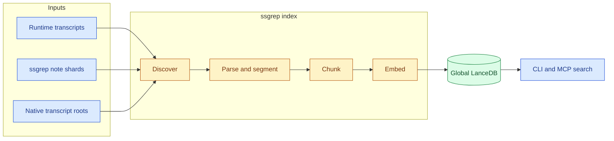
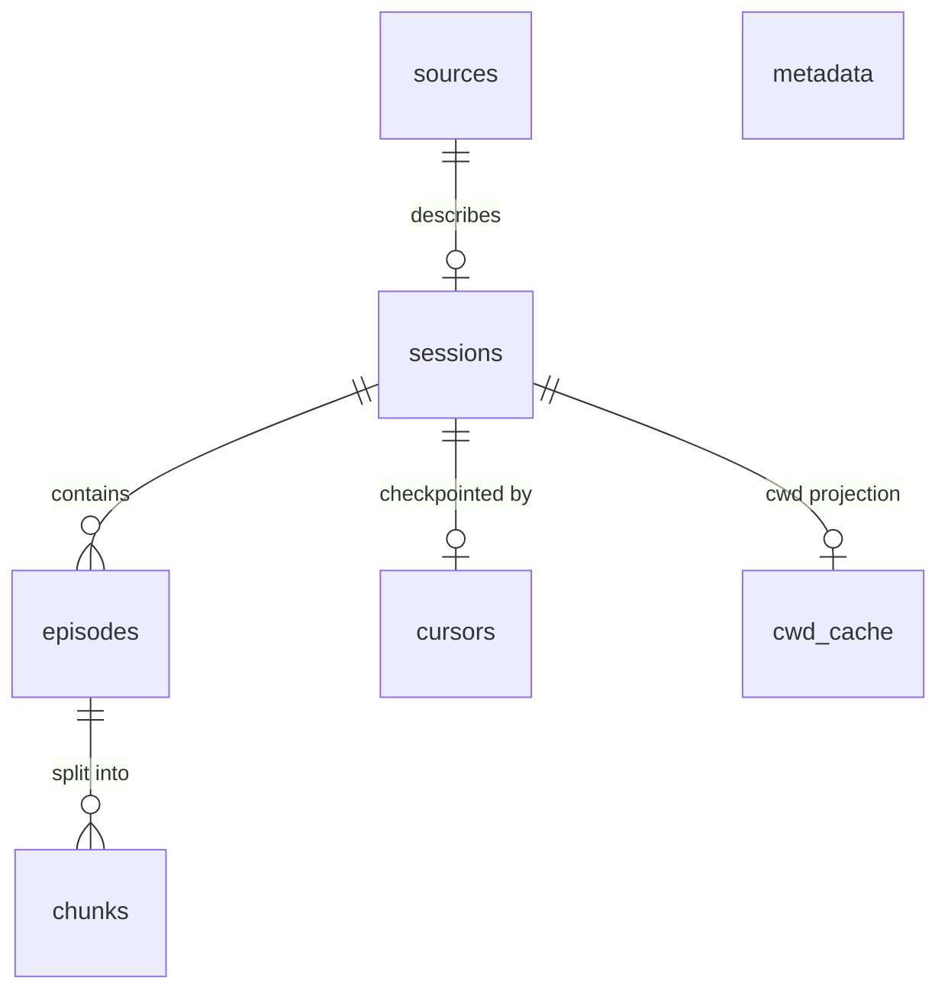
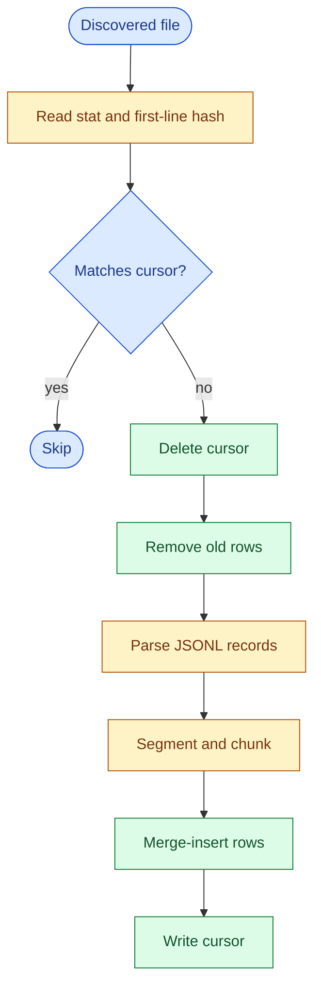
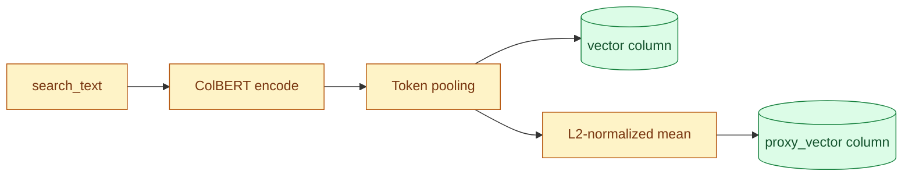
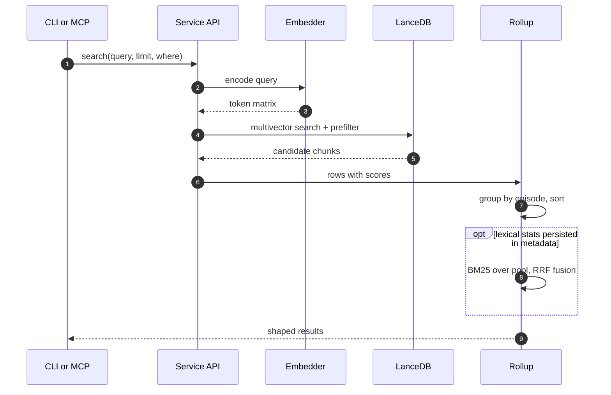

# Architecture

ssgrep is an offline-first search index for AI coding-agent session history. Five runtime adapters (Claude Code, OpenCode, Codex, Pi, and Prime Agent, registered in `src/ssgrep/sessions/adapters/registry.py`) normalize transcripts into one process-independent, all-project LanceDB database. See [runtimes.md](runtimes.md) for what each adapter reads.

Neither the process working directory nor a repository path selects storage or adds an implicit query filter. Every command and every MCP tool reads and writes the same global database.

## At a Glance



*Legend: blue = inputs and consumers, amber = ingestion stages, green = persistent storage. "Runtime transcripts" covers all five adapters.*

The same palette carries the same meaning in every diagram across this document set. The sections below expand each stage: [Discovery](#discovery), [Reconciliation](#reconciliation), [Chunking](#chunking), [Embeddings](#embeddings), and [Search](#search).

## Global Storage

The application-data root is resolved at runtime:

```python
platformdirs.user_data_path("ssgrep", appauthor=False)
```

`SSGREP_DATA_DIR` overrides the root. Write paths create it with mode `0700` on supported systems.

```text
<application-data-root>/
├── lancedb/       # all index tables and vector data
├── notes/         # native JSONL shards written by `ssgrep note`
└── index.lock     # advisory lock used by index reconciliation
```

A few properties of this layout matter for readers of the code:

- Read operations check whether `lancedb/` exists before connecting, because opening a Lance connection can create its target directory.
- There are no project-local indexes and no SQL sidecar.
- LanceDB is the only index persistence engine; note shards and the writer lock are ordinary adjacent files.

## Lance Tables

`src/ssgrep/store/schema.py` defines seven tables. The diagram shows how they relate; the sections that follow describe each one.



> [!NOTE]
> `metadata` is a standalone key/value table and relates to no other table. Column details are listed per table below.

| Table | Role | Keyed by |
|---|---|---|
| `chunks` | Multivector retrieval rows with denormalized metadata | `chunk_id` |
| `episodes` | Complete prompt and response text for `show` | episode ref `<session-id>:ep:<number>` |
| `sessions` | Source path and `source_status` per session | `session_id` |
| `cursors` | Incremental-ingestion checkpoint | source path |
| `metadata` | Schema version, model identity, counters | key |
| `cwd_cache` | Recorded `cwd` values for `--scope` evaluation | source path, size, mtime |
| `sources` | Persistent discovery registry | `key` |

### `chunks`

The multivector-retrieval table. Each row contains:

- identity: `chunk_id`, `episode_id`, `session_id`
- corpus location: `project`, `source_path`, `source_project`, `source_status`
- retrieval fields: `text`, `search_text`, per-token multivector `vector` (ColBERT, 96-d per token, float16 storage), `proxy_vector` (L2-normalized mean of the chunk's pooled token matrix, float32[96]), `content_type`
- episode metadata: `title`, `timestamp`, `git_branch`, `cwd`, `files_touched`, `tool_names`
- agent metadata: `is_subagent`, `parent_session_id`, `agent_type`, `agent_name`, `agent_description`, `agent_model`
- Claude metadata: `claude_version`, `entrypoint`, `permission_mode`, `user_type`

The scalar metadata is intentionally denormalized onto every chunk so Lance can apply a predicate before limiting retrieval candidates.

### `episodes`

Stores complete prompt and response text plus the episode metadata required by `show`. Search results reference an episode as `<session-id>:ep:<number>`.

### `sessions`

Maps `session_id` to the absolute source `path`, its `source_status` (`available` or `absent`), and the time it became absent.

### `cursors`

Stores the source path, number of complete bytes processed, source modification time, and first-line hash. It is the incremental-ingestion checkpoint.

### `metadata`

A key/value table holding the schema version, model identity and revision, vector dimension, most recent index time, and record counters.

### `cwd_cache`

Caches the recorded `cwd` values projected from each Claude transcript, keyed by source path, size, and modification time. Discovery uses this table to avoid rescanning unchanged files when evaluating `--scope`.

### `sources`

A persistent discovery registry: one row per transcript source ever indexed (keyed by `key`). Each row stores the full discovery snapshot (adapter, path, size, mtime, first-line hash, session and agent attribution) needed to reconstruct that source's descriptor after the file itself disappears.

This is what lets a no-longer-discovered source stay `absent` instead of being dropped. Rows are removed only by `ssgrep prune`.

## Discovery

A default index run calls `discover_sources` in `src/ssgrep/sessions/adapters/registry.py`, which iterates every registered runtime adapter (Claude Code, OpenCode, Codex, Pi, and Prime Agent) and concatenates what each discovers. The native adapter alone contributes three source kinds:

1. Claude Code transcripts beneath `$CLAUDE_CONFIG_DIR/projects` (normally `~/.claude/projects`).
2. ssgrep-owned note shards beneath the global application-data root.
3. Native transcript roots named by `SSGREP_TRANSCRIPT_DIRS`.

These sources are independent: notes and external roots can be indexed even when no Claude `projects/` directory exists, and they are discovered without `--scope` filtering. The other runtimes' locations are described in [runtimes.md](runtimes.md). Set `CLAUDE_CONFIG_DIR` when the Claude configuration is stored elsewhere.

### What Claude discovery includes

- Claude discovery excludes known sidecar locations such as per-project memory and per-session tool-result/workflow data, while retaining transcripts beneath `subagents/`.
- Main sessions use the source filename as their session identity.
- Subagents derive a unique identity from the parent session and their path beneath `subagents/`.
- Recorded `cwd` values are canonicalized lexically and become the absolute `project` metadata when available. The encoded Claude project directory is retained separately as `source_project`.

### Narrowing a run

| Flag | Effect on the input view |
|---|---|
| `--scope PATH` | Filters auto-discovered transcripts from every runtime that records a working directory (Claude Code, OpenCode, Codex, Pi, and Prime Agent): a source is included when a recorded `cwd` is equal to or beneath the requested absolute path. Notes and external roots are explicit inputs and remain included. |
| `--no-subagents` | Removes subagent files from the input view for that run. |

> [!IMPORTANT]
> Scope changes the input view for that run; it never changes the database location.

## Reconciliation

`ssgrep index` holds an exclusive advisory lock on `<application-data-root>/index.lock`, serializing index runs across local processes. MCP startup uses the same service path and therefore the same lock.

### Per-file steps



*Legend: blue = input and decision, amber = parsing stages, green = writes to LanceDB.*

For each discovered file:

1. Read its stat information and first-line hash.
2. Skip it when those values match its cursor.
3. Otherwise delete the cursor first and remove the source's existing session, episode, and chunk rows.
4. Read complete newline-terminated JSONL records. Malformed, oversized, and unknown records contribute to the run counters.
5. Segment records into episodes, harvest metadata, classify signal text, and build prompt/response chunks.
6. Merge-insert the rebuilt rows using deterministic primary keys.
7. Write the cursor last.

> [!NOTE]
> Deleting the cursor first ensures that an interrupted update is processed again on the next run. The per-source replacement is not exposed as a multi-table transaction, so a process interrupted after deleting rows can leave that source incomplete until reconciliation is run again.

### After the pass

After a complete default discovery pass, sources still in the database but no longer discovered are updated to `source_status = 'absent'` in the session, episode, and chunk tables. Their text remains searchable and result cards identify the missing source. A scoped run or a run with `--no-subagents` does not mark items outside its temporary view absent.

At the end of a successful run, ssgrep writes model, schema, timestamp, and parser metadata. A successful full reconciliation then compacts the chunks, episodes, and sessions tables (`table.optimize()`: fragment compaction, index refresh, and cleanup of rows past the library's 7-day retention window) and records `last_optimize_time`, visible in `status --json`. Per-table compaction failures are logged and never abort the run. Live polling runs never compact.

### Rebuilds

A rebuild resets every Lance table.

> [!WARNING]
> If a populated database would be replaced by fewer than half as many discovered sessions, the rebuild is refused unless the caller supplies `--allow-shrink`.

## Records and Episodes

Retrieval text is selected as follows:

| Record kind | Contributes to |
|---|---|
| user text blocks | prompt text |
| assistant text blocks | response text |
| system `away_summary` content | response text (can contribute) |
| tool results, tool calls, thinking blocks, images, local-command records, and `isMeta` records | nothing (no retrieval text) |

A new user prompt closes the preceding episode. A compaction boundary also closes a non-empty episode.

Metadata harvesting records the first timestamp, branch and cwd, tool names, paths used by `Read`/`Edit`/`Write`, and the available Claude and agent attributes.

Episode titles follow this precedence:

```text
custom title > AI title > last prompt > first user text > Episode N
```

## Chunking

Prompt and response streams are chunked independently with Chonkie, sized to the model's 299-token context window (its `model_max_length`):

```python
RecursiveChunker(tokenizer=<embed-model tokenizer>, chunk_size=235)  # CHUNK_TOKEN_BUDGET
OverlapRefinery(
    tokenizer=<embed-model tokenizer>,
    context_size=25,
    mode="token",
    method="prefix",
    merge=True,
)
```

### Why 235 + 25

Because `OverlapRefinery` prefix-merges up to `CHUNK_TOKEN_OVERLAP` (25, configurable with `SSGREP_CHUNK_OVERLAP`, clamped to [0, 117]) tokens of context onto each chunk, the budget keeps a chunk plus its overlap within the 299-token document limit.

The embedded string is actually the pipeline's `search_text` (`Title: <title>\nContent: <chunk>`), whose title prefix is trimmed by `rows._contextual_search_text` so the full embedded sequence always fits the model window.

The shipped default of 25 (previously 50) comes from a measured sweep: 25 kept sandbox quality proxies at or above the overlap-50 run while cutting stored token vectors about 7%, and 12 hurt recall and MRR and was rejected (measured with the eval harness; the sweep outputs are not kept in the repository).

### Properties

- The embedding model's tokenizer is loaded from the pinned model without loading the encoder.
- Independent streams preserve exact `content_type = 'prompt'` and `content_type = 'response'` predicates.
- Chunk identifiers incorporate the episode, content type, start position, and a content hash, making repeated ingestion idempotent.

## Embeddings

The pinned `lightonai/answerai-colbert-small-v1` late-interaction ColBERT model (loaded through PyLate) produces a normalized 96-dimensional vector per token.



*Legend: amber = embedding stages, green = stored columns.*

### Storage

Each chunk stores a `(num_tokens, 96)` multivector matrix in the `vector` column, declared as a Lance `MultiVector` with a `TextEmbeddingFunction` that binds `search_text` as the source field.

Document matrices are token-pooled before storage: PyLate's Ward-linkage cluster means merge each chunk's token vectors to about `1/pool_factor` of the original count (`SSGREP_POOL_FACTOR`, default 2; documents only, queries are never pooled).

The column stores float16 elements: the embedding compute path stays float32 end to end and only the write-boundary encoder quantizes. The same write fills `proxy_vector`, the L2-normalized mean of the pooled matrix, which backs the optional two-stage search path.

### Indexing and scoring

CocoIndex writes precomputed matrices at index time. At query time the same embedder encodes the query into a `(num_tokens, 96)` matrix and LanceDB scores chunks with native MaxSim against cosine IVF-PQ indexes, built once row counts allow and refreshed by post-reconcile compaction.

| IVF-PQ parameter | Value |
|---|---|
| `num_sub_vectors=12` | 12 sub-vectors |
| `num_bits=8` | 8-bit codes |
| `num_partitions = max(1, min(64, rows // 4096))` | derived from the live row count |

### Model loading

Model loading is cache-first (huggingface_hub's snapshot resolution). When the pinned snapshot is absent, ssgrep downloads the required files from Hugging Face; once cached, loading uses the local snapshot and makes no network request.

> [!TIP]
> The default model `lightonai/answerai-colbert-small-v1` is not gated, so its first download needs no Hugging Face login.

| Variable | Overrides |
|---|---|
| `SSGREP_EMBED_MODEL` | the pinned model |
| `SSGREP_EMBED_DIMENSION` | the model's 96-d default |
| `SSGREP_EMBED_DEVICE` | the device (auto-detects MPS/CUDA/CPU; `SSGREP_EMBED_DEVICE=cpu` forces the deterministic CPU path) |
| `SSGREP_NUM_THREADS` | the size of the torch thread pool |

## Search



### Query execution

The service API validates the query and global database, embeds the query into a `(num_tokens, 96)` matrix, and asks LanceDB for a native multivector search over the `vector` column:

```python
table.search(
    query_matrix,
    vector_column_name="vector",
).where(predicate, prefilter=True)
```

LanceDB computes MaxSim per chunk and returns the engine's `_distance` column; queries carry `refine_factor(2)` and `nprobes(16)`, and ssgrep converts the rescored distance to a score with `maxsim = 1 - _distance`.

The engine limit is the requested result limit multiplied by the oversample factor (`SSGREP_OVERSAMPLE`, default 8) so episode rollup sees candidates from more than one episode; response shaping still returns at most the requested limit.

`search_text` is the raw chunk prefixed with a short title line, giving response-only chunks topic context without leaking that prefix into the verbatim `text` excerpt.

### Optional two-stage path

Setting `SSGREP_TWO_STAGE` (off by default) switches to a two-stage path:

- stage 1 ranks chunks by `proxy_vector` ANN
- stage 2 rescores only those candidates with exact client-side MaxSim reported on the same `1 - _distance` scale

It measured p50 113.3 ms → 124.0 ms and p95 117.8 ms → 157.2 ms against the single-stage path on a 27,456-chunk benchmark corpus and ships off (measured with the eval harness; the sweep outputs are not kept in the repository).

### Predicates

Caller predicates and structured filters are joined with `AND` and applied before ranking. With no predicate, search spans every project and includes archived sources.

The CLI and MCP accept a raw Lance SQL predicate. The Python service can also receive a structured `SearchFilters` value; both forms compile into one `AND` predicate. Examples:

```text
project = '/Users/me/code/app'
source_status = 'available' AND content_type = 'response'
is_subagent = true AND agent_model = 'claude-opus-4-6'
timestamp >= timestamp '2026-01-01T00:00:00'
```

Valid predicate columns are the scalar fields on the `chunks` table. There is no separate project-path alias.

### Episode rollup

Lance returns a bounded candidate set: the requested result limit multiplied by the oversample factor. `_rows_to_episodes` groups rows by episode and sorts deterministically by `(-score, chunk_id)` — row order from the backend can never choose a different winner or excerpt.

- An episode's score is its best chunk's score. A bounded multi-chunk evidence term exists in the rollup but currently carries zero weight, so extra chunks do not change the score.
- Episodes order by score, then timestamp, then episode ID.
- The backend score is used for ranking and is not normalized into a probability.

### Hybrid lexical fusion

After rollup, `src/ssgrep/search/__init__.py` fuses a BM25-style lexical signal into the MaxSim episode ranking. This stage is conditional: it runs only when the `metadata` table carries a `lexical_stats` entry, which `pipeline/app.py` writes at the end of every successful index run from a full scan of chunk text (document frequencies, average chunk length, and document count). An index written before this feature keeps pure MaxSim ordering until the next `ssgrep index`.

When stats are present, `src/ssgrep/search/lexical.py`:

- tokenizes the query and each pool row's `text` into lowercase alphanumeric/underscore tokens (identifiers survive intact; tokens shorter than 2 characters are dropped)
- scores each row with BM25 (`k1 = 1.2`, `b = 0.75`) against the persisted corpus statistics and keeps the best chunk score per episode
- fuses the MaxSim ranking and the lexical ranking with Reciprocal Rank Fusion: each episode accumulates `weight / (k + rank)` per signal, with `k = 60` by default

The episode's reported score becomes its fused value, so ranking reflects both signals. If the query has no usable tokens or no pool row scores above zero lexically, the MaxSim scores are returned unchanged.

| Variable | Default | Accepted values | Controls |
|---|---|---|---|
| `SSGREP_RRF_K` | 60 | integer, clamped to [1, 500] | The RRF rank constant `k`. |
| `SSGREP_DENSE_WEIGHT` | 1.0 | float, clamped to [0.25, 4.0] | Weight applied to the MaxSim signal; the lexical signal always weighs 1.0. |

### Response shaping

Response shaping applies the requested result limit and approximate token budget. Each excerpt is first windowed around the query (`_excerpt_window`: exact phrase anchor, otherwise the densest token window, else the leading window), so the matched span is visible in terminal, JSON, and MCP output alike.

| Response field | Meaning |
|---|---|
| `excerpts_truncated` | records either windowing or budget truncation |
| `omitted_count`, `clamped` | round out the response contract |
| `total_matches` | the number of distinct episodes represented in the retrieved candidate set, not a full unbounded corpus count |

## Detail Retrieval

`show` validates an episode ref and performs an exact lookup in the `episodes` table. It returns the stored metadata and bounds prompt text at 50,000 characters and response text at 150,000 characters. Separate truncation flags make those bounds visible to JSON and MCP consumers.

Terminal rendering escapes transcript-derived control bytes while retaining real newlines and tabs in body text. JSON and MCP retain original content within their documented output bounds.

## Status and Archive State

`status` reads Lance counts and metadata without creating a database or scanning the source filesystem. `IndexStats` contains:

- session, episode, and chunk counts
- database byte size and most recent index time
- model ID, vector dimension, and schema version
- malformed and skipped record counts from the most recent run
- tombstoned source and chunk counts
- database existence and the application-data path

Because status is a database observation rather than a discovery pass, users run `ssgrep index` when they want source changes reconciled.

Absent sources remain searchable and are marked on result cards. `prune` selects absent sessions, optionally filters them by how long they have been absent, and permanently deletes their session, episode, chunk, and cursor rows. No automatic deletion occurs.

> [!CAUTION]
> An explicit `index --rebuild` reconstructs the database from current discovery and consequently drops archived sources that are no longer discoverable.

## Services, CLI, and MCP

`src/ssgrep/services/api.py` is the framework-free boundary shared by the command adapters and MCP tools. It exposes global `index`, `search`, `show`, and `status` operations.

The MCP module imports FastMCP only when constructing the server. Before construction completes it:

1. disables FastMCP's banner/update check,
2. registers exactly three tools, and
3. launches one global reconciliation in a background daemon thread (named `ssgrep-mcp-reconcile`), so startup does not block the client's handshake.

That reconciliation is best-effort: failures are logged to stderr and do not prevent stdio serving. The tools then use the same service API and database as the CLI:

| Tool | Signature |
|---|---|
| search | `search_sessions(query, limit=10, where=None)` |
| detail | `show_session(ref, max_chars=20000)` |
| status | `index_status()` |

Tool calls are read-only. `show_session` applies its combined `max_chars` budget on top of the detail layer's per-field bounds. There is intentionally no MCP note-writing tool.

## Module Map

| Package | Responsibility |
|---|---|
| `sessions/` | discovery, JSONL parsing, episode segmentation, signal classification, metadata, and notes |
| `indexing/` | Chonkie chunking and model-identity constants (ColBERT / 96-d per token); `indexer` is a thin serializing shim (flock) that delegates global reconciliation to `pipeline/` |
| `pipeline/` | the CocoIndex ingestion engine — see below |
| `store/` | platform paths, Lance schemas, and the lazy Lance repository |
| `search/` | multivector query, predicates, episode roll-up, response shaping, detail retrieval, and rendering |
| `services/` | shared Python API, MCP server, and database observability |
| `utilities/` | contract dataclasses, path identity, and terminal-safe text |
| `cli/` | usecli command adapters and process exit behavior |

The `pipeline/` package is made up of:

- the traced components (`components.py`)
- Pydantic declared row models (`rows.py`)
- the embedding provider (`ColBERTEmbedder` op)
- the persistent source registry and per-session OpenCode fingerprints (`sources.py`)
- per-run state identity (`state.py`)
- episode builders (`episodes.py`)
- `app.py` (dedicated per-app `coco.Environment`, catch-up cycle, tombstone post-step, foreground `--live` poll)
