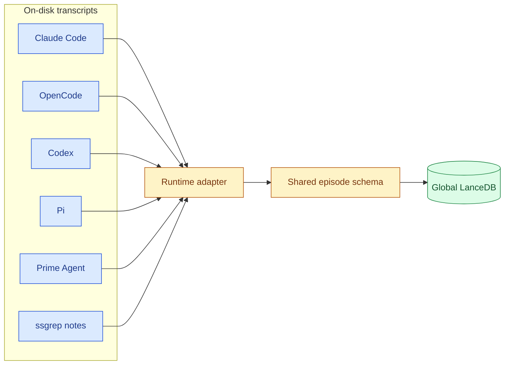

# Supported Runtimes

ssgrep ingests sessions from every coding agent it can find on the machine, through one adapter per runtime. Every adapter normalizes its runtime's transcripts into one shared episode schema, so a single search spans all of them.

Each adapter reads only the runtime's own on-disk transcript data and treats those files as untrusted local input:

- newline-terminated records only
- a shared size limit
- never invoking the runtime or a network service

*Legend: blue = runtime transcript data, amber = normalization, green = persistent storage.*

## Runtime Summary

| Runtime | Transcript source | Default location | Environment overrides |
|---|---|---|---|
| **Claude Code** | native record-pair JSONL | `~/.claude/projects` | `CLAUDE_CONFIG_DIR`, `SSGREP_TRANSCRIPT_DIRS` |
| **OpenCode** | local SQLite store | `~/.local/share/opencode/opencode.db` | `SSGREP_OPENCODE_DB`, `XDG_DATA_HOME` |
| **Codex** | rollout session JSONL | `~/.codex/sessions` | `SSGREP_CODEX_SESSIONS_DIR`, `CODEX_SESSIONS_DIR`, `CODEX_HOME` |
| **Pi** | session JSONL | `~/.pi/agent/sessions` | `SSGREP_PI_SESSIONS_DIR`, `PI_SESSION_DIR`, `PI_CODING_AGENT_SESSION_DIR`, `PI_CODING_AGENT_DIR` |
| **Prime Agent** | session JSONL + `session-artifacts/` | `~/.prime/agent/sessions` | `SSGREP_PRIME_AGENT_SESSIONS_DIR`, `PRIME_AGENT_SESSION_DIR`, `PRIME_AGENT_CODING_AGENT_SESSION_DIR`, `PRIME_AGENT_CODING_AGENT_DIR` |
| **omp** | session JSONL | `~/.omp/agent/sessions` | `SSGREP_OMP_SESSIONS_DIR`, `OMP_SESSIONS_DIR`, `OMP_AGENT_DIR` |

> [!TIP]
> `ssgrep status` reports the runtime census (`Runtimes: claude=12, opencode=3, ...`), and every search result can be narrowed with `--where "runtime = 'pi'"`.

## Claude Code

Claude Code transcripts are read as the native record-pair JSONL under `$CLAUDE_CONFIG_DIR/projects` (normally `~/.claude/projects`).

| Kind | Path pattern |
|---|---|
| Main session | `<projectDir>/<sessionId>/<sessionId>.jsonl` |
| Subagent transcript | `<projectDir>/<sessionId>/subagents/**/*.jsonl` (including `subagents/workflows/`) |

Main vs. subagent is classified by path position, and subagent sessions record their `parent_session_id`.

Authored `ssgrep note` entries (runtime `ssgrep`) and `SSGREP_TRANSCRIPT_DIRS` external roots (runtime `native`) are read by the same native-format adapter.

`ssgrep init` installs the skill to `$CLAUDE_CONFIG_DIR/skills/ssgrep`.

## OpenCode

OpenCode sessions are read from its local SQLite store — `opencode.db` under the XDG data home (`~/.local/share/opencode/opencode.db`), or wherever `SSGREP_OPENCODE_DB` points.

Discovery and reads open a read-only connection (`mode=ro`, `PRAGMA query_only`) and hold one SQLite snapshot per query, so the store can be ingested while OpenCode is running without locking it or writing to it.

The `session`, `message`, and `part` tables are normalized into episodes:

- **Kept as transcript content:** text, tool, file, and patch parts.
- **Omitted:** agent/compaction/reasoning/retry/snapshot/subtask/step bookkeeping parts.
- **Also omitted:** synthetic parts (harness-injected tool-call echoes and text parts that open with a `<system-reminder>` notification).

`ssgrep init` installs the skill to `~/.config/opencode/skills/ssgrep` (honoring `XDG_CONFIG_HOME` and `OPENCODE_CONFIG_DIR`).

## Codex

Codex CLI persists each interactive/exec session as an append-only **rollout** JSONL file under `~/.codex/sessions` (one file per session, organized by date).

| Record type | What ssgrep reads from it |
|---|---|
| `session_meta` | the session id and starting `cwd` |
| `turn_context` | per-turn `cwd` and the active `model` |
| `response_item` | the conversation: `user`/`assistant`/`developer` messages, plus `function_call` and `custom_tool_call` items as assistant tool use |

Reasoning (thinking) items, `*_output` tool-result echoes, and `token_count` / `item_completed` / bookkeeping records are excluded.

Override the session directory with `SSGREP_CODEX_SESSIONS_DIR` or `CODEX_SESSIONS_DIR`, or relocate the whole `~/.codex` directory with `CODEX_HOME`. Codex rollouts are single-threaded, so there is no subagent concept to filter.

`ssgrep init` installs the skill to `~/.codex/skills/ssgrep`.

## Pi

Pi sessions are read as the append-only session JSONL under `~/.pi/agent/sessions` (override with `SSGREP_PI_SESSIONS_DIR`, `PI_SESSION_DIR`, `PI_CODING_AGENT_SESSION_DIR`, or relocate the agent directory with `PI_CODING_AGENT_DIR`).

The `session` header carries the id, `cwd`, `modelId`, and `rlmDepth` (a positive depth marks a child session, with `parentSessionId` linking back); `model_change` and assistant `message` records update the active model.

Omitted because they carry no indexable transcript signal:

- thinking, tool results, images, and extension-specific blocks
- state/context entries like `agent_status`, `compaction`, `label`, and `session_state`

`ssgrep init` installs the skill to `~/.pi/agent/skills/ssgrep`.

## Prime Agent

Prime Agent sessions share Pi's session format and are read from `~/.prime/agent/sessions` plus its `session-artifacts/` children (both always included; artifacts are treated as child/subagent sessions).

Override with `SSGREP_PRIME_AGENT_SESSIONS_DIR`, `PRIME_AGENT_SESSION_DIR`, `PRIME_AGENT_CODING_AGENT_SESSION_DIR`, or relocate the agent directory with `PRIME_AGENT_CODING_AGENT_DIR`.

`ssgrep init` installs the skill to `~/.prime/agent/skills/ssgrep`.

## omp

omp sessions share Pi's session format and are read as the append-only session JSONL under `~/.omp/agent/sessions` (override with `SSGREP_OMP_SESSIONS_DIR` or `OMP_SESSIONS_DIR`, or relocate the agent directory with `OMP_AGENT_DIR`). The `session` header carries the id and `cwd`; `model_change` and assistant `message` records update the active model. Unlike Pi, omp writes a `title` record (often an empty auto-title) before the header, and later `title_change` records carry user-visible session titles — both are normalized like Pi titles, with empty titles skipped. Thinking, tool results, images, and extension-specific entries (`custom`, `custom_message`, `thinking_level_change`, `service_tier_change`) carry no indexable transcript signal and are omitted. `ssgrep init` installs the skill to `~/.omp/agent/skills/ssgrep`.

## Model and Device Configuration

When Claude history is stored outside `~/.claude`, set `CLAUDE_CONFIG_DIR` to the directory that contains `projects/`. Notes and `SSGREP_TRANSCRIPT_DIRS` remain indexable when that Claude directory is absent.

The first indexing run downloads the pinned `lightonai/answerai-colbert-small-v1` late-interaction ColBERT model (96-d per token) from Hugging Face if it is not already cached.

> [!NOTE]
> The download is not gated, so no Hugging Face login is required. After the one-time download, indexing, search, and the MCP server run fully offline.

| Variable | Default | Controls |
|---|---|---|
| `SSGREP_EMBED_MODEL` | pinned ColBERT model | Embedding model override |
| `SSGREP_EMBED_DIMENSION` | 96 | Vector dimension override |
| `SSGREP_EMBED_DEVICE` | auto-detect | Force `cpu` or `mps`; auto picks MPS on Apple Silicon / CUDA on NVIDIA / CPU |
| `SSGREP_NUM_THREADS` | up to 8 (capped by core count) | Torch thread count |
| `SSGREP_EMBED_BATCH_SIZE` | 64 | Texts per model call |
| `SSGREP_EMBED_FLUSH_MS` | 50 | How long the batcher idles for more texts |

> [!TIP]
> Index-time embedding coalesces every source's chunks into one shared `ColBERT.encode` batch (deduplicating byte-identical chunks), so `SSGREP_EMBED_BATCH_SIZE` and `SSGREP_EMBED_FLUSH_MS` tune that batch and can be raised on large-memory Apple Silicon machines to keep the device saturated.
