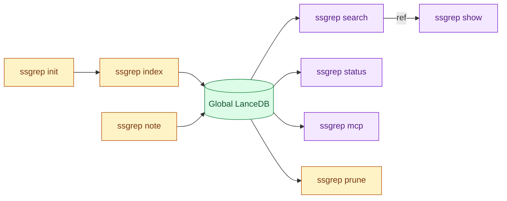
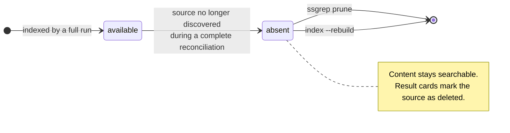

# Command Reference

Run `ssgrep --help` or `ssgrep <command> --help` for the installed CLI's authoritative option list.

## Command Lifecycle



*Legend: amber = commands that write to the index, green = the database, purple = read-only commands.*

| Command | Purpose |
|---|---|
| [`init`](#init--one-time-setup) | One-time setup: skills, MCP registration, first index |
| [`index`](#index--build-or-update-the-global-index) | Build or update the global index |
| [`search`](#search--find-relevant-episodes) | Find relevant episodes |
| [`show`](#show--inspect-one-episode) | Inspect one episode |
| [`status`](#status--inspect-the-global-database) | Inspect the global database |
| [`note`](#note--add-a-durable-searchable-note) | Add a durable searchable note |
| [`prune`](#prune--permanently-delete-archived-content) | Permanently delete archived content |
| [`mcp`](#mcp--start-the-mcp-stdio-server) | Start the MCP stdio server |
| [`rules`](#rules--print-the-operating-rules) | Print the operating rules |
| [`version`](#version) | Print the version |

## `index` — Build or update the global index

```bash
ssgrep index [--rebuild] [--no-subagents] [--quiet] [--allow-shrink] [--scope PATH] [--live] [--full-reprocess]
```

With no options, this reconciles the complete discovered corpus. Files whose size, modification time, and first-line hash have not changed are skipped; changed files are parsed again.

| Option | Effect |
|---|---|
| `--allow-shrink` | Confirms a rebuild when discovery would reduce a populated database to less than half its existing session count. |
| `--no-subagents` | Excludes subagent transcripts for this run. |
| `--quiet` | Suppresses the human progress line. |
| `--rebuild` | Recreates the Lance tables and embeddings. |
| `--scope PATH` | Ingests only sessions with a recorded `cwd` equal to or beneath the absolute `PATH` for this run (applied across every runtime that records a working directory). It does not create a separate database. Authored notes and explicitly configured external roots remain included. |
| `--live` | Keeps polling for changes in the foreground until interrupted, instead of exiting after one reconciliation pass. No daemon is installed; the process must stay running. |
| `--full-reprocess` | Re-runs every discovered source, ignoring the cursor checkpoints that normally skip unchanged files. |

A normal full run marks indexed sources that are no longer discovered as absent but retains their searchable content. See [Archive Semantics](#archive-semantics).

## `init` — One-time setup

```bash
ssgrep init
```

`init` does three things in order:

1. Discovers every supported runtime and installs an idempotent `ssgrep` skill into each agent harness's own global skill directory.
2. Registers the `ssgrep mcp` stdio server with every supported MCP client (the same registration `ssgrep mcp install` performs).
3. Runs one normal index.

| Runtime | Skill directory | Honors override |
|---|---|---|
| `claude` | `$CLAUDE_CONFIG_DIR/skills/ssgrep` | `CLAUDE_CONFIG_DIR` |
| `opencode` | `~/.config/opencode/skills/ssgrep` | `XDG_CONFIG_HOME` / `OPENCODE_CONFIG_DIR` |
| `codex` | `~/.codex/skills/ssgrep` | `CODEX_HOME` |
| `pi` | `~/.pi/agent/skills/ssgrep` | `PI_CODING_AGENT_DIR` |
| `prime-agent` | `~/.prime/agent/skills/ssgrep` | `PRIME_AGENT_CODING_AGENT_DIR` |

> [!TIP]
> Safe to re-run: an exact re-run leaves files untouched, upgrades re-render managed skill files, and user edits are never overwritten.

`--json` returns `{ok, skills, mcp, sources, index}`, where `mcp` maps each client name to `{status, config}`.

## `search` — Find relevant episodes

```bash
ssgrep search <QUERY> [--limit N] [--token-budget T] [--where PREDICATE]
```

Search is global by default. LanceDB embeds the query into a token matrix and scores every chunk with native MaxSim, then ssgrep keeps the best-ranked chunk for each episode.

| Option | Effect |
|---|---|
| `--limit` | Defaults to 10 and is capped at 50. |
| `--token-budget` | Defaults to 1500 and bounds the approximate size of returned cards. |
| `--where` | Supplies a raw SQL predicate applied before ranking. |

### Predicate fields

Useful predicate fields include:

| Group | Fields |
|---|---|
| identity and location | `project`, `source_path`, `source_project`, `source_status`, `session_id`, `episode_id`, `runtime` |
| episode metadata | `content_type`, `title`, `timestamp`, `git_branch`, `cwd`, `files_touched`, `tool_names` |
| agent metadata | `is_subagent`, `parent_session_id`, `agent_type`, `agent_name`, `agent_description`, `agent_model` |
| Claude metadata | `claude_version`, `entrypoint`, `permission_mode`, `user_type` |

Examples:

```bash
ssgrep search "database retry" --where "project = '/Users/me/code/app'"
ssgrep search "permission issue" --where "is_subagent = true AND content_type = 'response'"
ssgrep search "old workaround" --where "source_status = 'absent'"
```

### Result cards

Human-readable cards contain the episode title, a relevance score, project/source metadata when available, files, agent attribution for subagents, and a bounded excerpt. Scores are ranking values, not normalized probabilities. Use the returned ref with `show`.

### Exit codes

| Code | Meaning |
|---|---|
| `0` | results found |
| `1` | unexpected failure |
| `2` | usage error |
| `3` | no matching data, an empty index, or an unknown `show` ref |
| `4` | missing or unusable index |

## `show` — Inspect one episode

```bash
ssgrep show <REF>
```

Returns the prompt and response stored for an episode. The ref format is `<session-id>:ep:<episode-number>`.

The CLI detail layer bounds prompts at 50,000 characters and responses at 150,000 characters and reports truncation in JSON.

## `status` — Inspect the global database

```bash
ssgrep status
ssgrep status --json
```

Text output reports:

- session, episode, and chunk counts
- database size in bytes and MiB
- the time of the most recent index run
- the embedding model and vector dimension
- skipped and malformed record counts from the most recent run
- tombstoned source/chunk counts when archived content exists
- the archived-source count when sources were served from their indexed snapshot this run (transcript file missing from disk)

JSON additionally exposes the complete `IndexStats` contract. The total counts include archived rows; the tombstone fields identify the archived subset.

## `note` — Add a durable searchable note

```bash
ssgrep note --title "how do we handle retry backoff" --body "Use bounded exponential backoff."
printf '%s\n' "Longer answer" | ssgrep note --title "what is our retry policy" --body -
ssgrep note --title "project-specific convention" --body "..." --project-dir /path/to/project
```

The title becomes the prompt and the body becomes the response in a native transcript record pair.

> [!TIP]
> Phrase the title like a query you expect to search for later.

- `--project-dir` records the note's `cwd` metadata; it does not select another database.
- Notes are written only beneath the global ssgrep application-data directory.
- The command then runs reconciliation so the note is normally searchable immediately; if reconciliation fails, the saved note is picked up by a later successful `ssgrep index`.
- There is no MCP write tool.

## `prune` — Permanently delete archived content

```bash
ssgrep prune [--older-than DAYS] [--dry-run] [--yes]
```

`prune` operates only on sessions whose `source_status` is `absent`.

| Option | Effect |
|---|---|
| `--dry-run` | Previews the matching session, episode, and chunk counts. |
| `--older-than DAYS` | Selects sessions that have been absent for at least that many days; the default `0` selects every tombstoned session. |
| `--yes` | Skips confirmation and is required for non-interactive deletion. |

> [!CAUTION]
> Pruning cannot be undone. Back up the application-data root first if it may hold the only remaining copy.

## `mcp` — Start the MCP stdio server

```bash
ssgrep mcp
```

Starts the read-only MCP server (`search_sessions`, `show_session`, `index_status`). Server construction reconciles every discovered runtime in a background thread, so a fresh installation builds its index without a separate `ssgrep index` run.

See [mcp-setup.md](mcp-setup.md) for client configuration and tool details.

### `mcp install` — Register ssgrep with MCP clients

```bash
ssgrep mcp install            # every supported client
ssgrep mcp install cursor zed # a subset: claude, cursor, zed, codex, opencode
```

Writes the `ssgrep mcp` stdio registration into each client's own configuration (Claude Code is registered through its `claude mcp add` CLI).

Idempotent: an exact existing entry is untouched, a stale ssgrep-owned entry is replaced, and unrelated settings are preserved.

Each client reports one of these statuses:

- `installed`
- `updated`
- `already_installed`
- `skipped: ...`
- `error: ...`

With `--json`, each returns `{status, config}`. Exit codes: `0` on success, `2` for an unknown client name.

## `rules` — Print the operating rules

```bash
ssgrep rules
ssgrep rules --short
ssgrep rules --json
```

Prints the same guidance body that `init` installs as a skill (see [agent-guidance.md](agent-guidance.md)).

| Form | Output |
|---|---|
| `ssgrep rules` | the full guidance body |
| `--short` | only the numbered non-negotiables, sized to paste into a project's `AGENTS.md` or `CLAUDE.md` |
| `--json` | `{ok, data: {version, executable, short, full}}` |

Output is raw markdown by design — it is meant to be pasted and read by agents — and the command reads no index, loads no model, and creates no files, so it works on a fresh install and inside CI.

## `version`

```bash
ssgrep version
ssgrep --version
```

`help` and `about` are also available from the CLI framework.

## JSON Output

Data-oriented commands accept the global `--json` option. Successful output uses a single envelope:

```json
{"ok": true, "data": {"...": "command result"}}
```

A known data-layer failure (missing index, empty query, unknown ref, and similar) fails with a JSON document carrying a machine-readable condition and the suggested recovery command when one is safe:

```json
{
  "ok": false,
  "condition": "missing_index",
  "message": "No global index found. Run `ssgrep index` first.",
  "command": "ssgrep index"
}
```

A plain usage error (unknown flag, unknown `mcp install` client name, and similar) instead surfaces the CLI framework's generic envelope, `{"ok": false, "error": {"type": "Exit", "message": "...", "code": N}}`.

> [!IMPORTANT]
> Either way, the process exit code (see [Exit codes](#exit-codes)) is the reliable signal to script against.

## Archive Semantics

ssgrep stores chunk and episode text rather than offsets into mutable source files. During a complete reconciliation, a transcript that is no longer discovered is marked `source_status = 'absent'`; its content remains searchable and result cards are marked as source-deleted.



To restrict results to files still present:

```bash
ssgrep search "query" --where "source_status = 'available'"
```

To inspect and remove archived data:

```bash
ssgrep status
ssgrep prune --dry-run
ssgrep prune --yes
ssgrep prune --older-than 30 --yes
```

`prune` is the command dedicated to deleting selected tombstoned rows.

> [!WARNING]
> A full `index --rebuild` instead reconstructs every table from current discovery and therefore does not preserve undiscovered archived rows.
